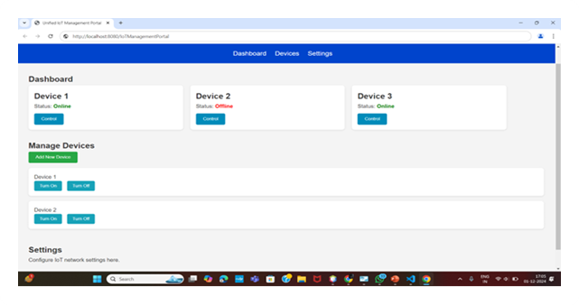

# IoT Management Portal

## Description
A centralized system designed to monitor, manage, and control IoT devices through a unified interface.

## Features
- Real-time device monitoring  
- Data collection and management  
- Centralized control system  
- Device status tracking and alerts  
- Report generation for device activity  

## Technologies Used
- Python  
- MySQL  
- HTML  
- CSS  
- JavaScript  
- Figma (UI Design)  

## My Contribution
- Developed backend logic for device management  
- Designed system architecture and workflow  
- Implemented data handling and integration  

## Screenshots
<!-- Add your images here -->

## System Workflow

### 1. Login System
- User enters username and password  
- System validates credentials using database  
- If valid, user is redirected to dashboard  
- If invalid, error message is displayed  

### 2. Device Registration
- User inputs Device ID, Device Name, and Owner  
- System checks for duplicate Device ID  
- If unique, device is added to database  
- Otherwise, user is notified  

### 3. Device Monitoring
- System retrieves device data from database  
- Displays real-time device status  
- Alerts user if any device is offline  

### 4. Device Control
- User selects device and sends command  
- System communicates with device  
- Displays success or failure response  

### 5. Report Generation
- User selects time range and devices  
- System fetches historical data  
- Generates usage and status reports  
- Displays results in table or graph format  

## System Design Overview
The system follows a centralized architecture where all IoT devices are managed through a backend server. It handles authentication, device communication, data storage, and reporting in a structured workflow.
